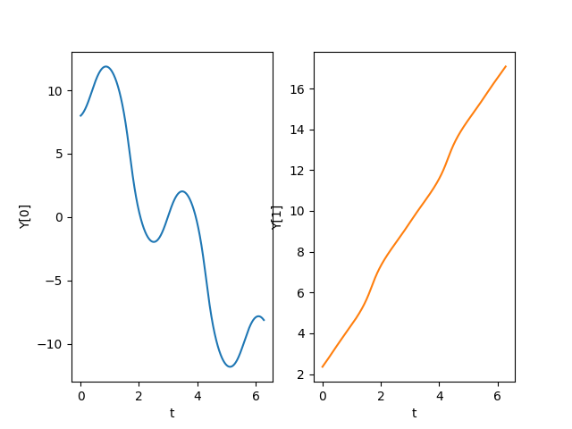
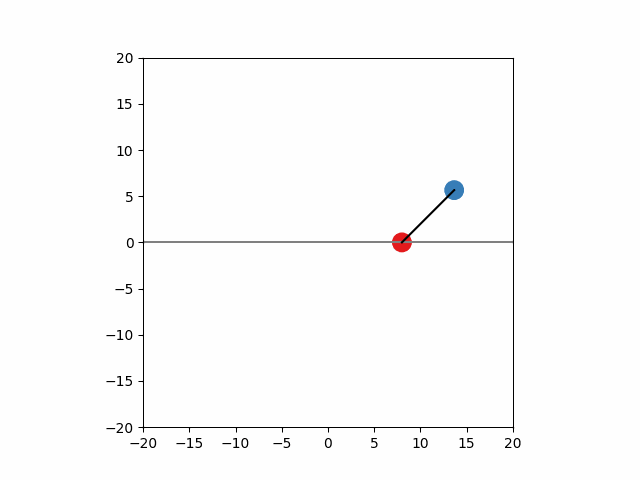

# MechSolver
This Solver is designed to find numerical solutions to Mechanics based problems. For that, a system of first order differential equations related to a specific problem is given. The solution is then computed numerically by the SciPy-based Runge-Kutta procedure. The result can the be plotted as a trajectory of mass points, simple geometric objects (e.g. line, square) or custom shapes (e.g. spring).

## Example: Free moving pendulum
### Find lagrangian function manually
$$
\mathcal{L} = T-V = \frac{m_1+m_2}{2}\dot{x}_1^2+\frac{m_2}{2}l^2\dot{\varphi}^2+m_2 l \dot{x}_1 \dot{\varphi} \cos{\varphi} + m_2 g l \cos{\varphi}
$$
### Defining differential equation system
$$
\begin{align}
\dot{x} &= v,\\
\dot{\varphi} &= \omega,\\
\dot{v} &= -\frac{-m_2g\sin\varphi\cos\varphi+m_2l\dot{\varphi}^2\sin\varphi}{m-m_2\cos^2\varphi},\\
\dot{\omega} &= \frac{m_2l\dot{\varphi}^2\sin\varphi+mg\tan\varphi}{m_2l\cos\varphi-\frac{ml}{\cos\varphi}}
\end{align}
$$
```
def equationSystem(Y, t):
        dY = [None]*4
        dY[0] = Y[2]
        dY[1] = Y[3]
        dY[2] = (-m2*g*np.sin(Y[1])*np.cos(Y[1]) + m2*l*Y[3]**2*np.sin(Y[1])) / (m - (m2*np.cos(Y[1])**2))
        dY[3] = ((m2*l*Y[3]**2*np.sin(Y[1])) + m*g*np.tan(Y[1])) / (m2*l*np.cos(Y[1]) - m*l/np.cos(Y[1]))
        return dY
```
### Defining transformation to cartesian coordinates
$$
\begin{align}
x_1 &= x, &\quad y_1 &= 0, \\
x_2 &= x + l \sin{\varphi}, &\quad y_2 &= -l \cos{\varphi}
\end{align}
$$
```
def coordTrans(pos):
        x1 = pos[0]
        y1 = 0.0*pos[0]
        x2 = l*np.sin(pos[1]) + x1
        y2 = -l*np.cos(pos[1]) + y1
        return [x1, y1, x2, y2]
```
### Declaring parameters
$$
\begin{equation}
m_1 = \tilde{m}_1 \text{ kg}, \quad m_2 = \tilde{m}_2 \text{ kg}, \quad l = \tilde{l} \text{ m}, \quad g \approx 9.81 \text{ m s}^{-2}, \quad m=m_1+m_2
\end{equation}
$$
```
# suspension mass
m1 = 1.0
# pendulum mass
m2 = 1.0
# pendulum length
l = 3.0
# gravitational acceleration
g = 9.81
# total mass
m = m1+m2
```
### Declaring initial conditions
$$
\begin{equation}
x_0 = \tilde{x} \text{ m}, \quad \varphi_0 = \tilde{\varphi}, \quad v_0=\tilde{v} \text{ m s}^{-1}, \quad \omega_0=\tilde{\omega} \text{ s}^{-1}
\end{equation}
$$
```
x0 = 4.0
phi0 = 150*np.pi/180
v0 = 4.0
omega0 = 2.5
Y0 = np.array([x0, phi0, v0, omega0])
```
### Simple plot result

### Advanced animation result
