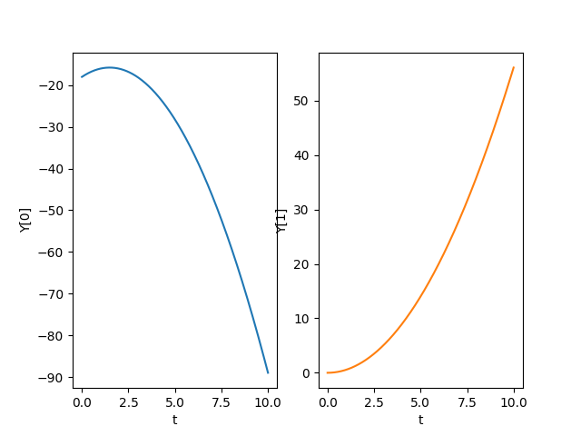

# Example: Rolling cylinder on angled moving Plane
## Find langrangian function
$$
\mathcal{L} = \frac{m+M}{2}\dot{u}^2+\frac{I + M R^2}{2}\dot{\theta}^2+M R \dot{u} \dot{\theta} \cos{\varphi} + M g R \theta \sin{\varphi}
$$
## Defining differential equation system
$$
\begin{align}
\dot{u} &= v,\\
\dot{\theta} &= \omega,\\
\dot{v} &= -\frac{c_1 c_2 g \cos{\varphi}\sin{\varphi}}{1-c_1 c_2 \cos^2{\varphi}},\\
\dot{\omega} &= \frac{c_2 g \sin{\varphi}}{R\left(1-c_1 c_2 \cos^2{\varphi}\right)}
\end{align}
$$
```
def equationSystem(t, Y):
    dY = [None]*4
    dY[0] = Y[2]
    dY[1] = Y[3]
    dY[2] = -c1*c2*g*np.sin(phi)*np.cos(phi) / (1 - c1*c2*np.cos(phi)**2)
    dY[3] = c2*g*np.sin(phi) / (R * (1 - c1*c2*np.cos(phi)**2))
    return dY
```
## Defining transformation to cartesian coordinates
$$
\begin{align}
x_1 &= u, &\quad y_1 &= 0, \\
x_2 &= u + R \theta \cos{\varphi}, &\quad y_2 &= H - R \theta \sin{\varphi}
\end{align}
$$
```
def coordTrans(self, pos):
    x = pos[0] + R*pos[1]*np.cos(phi)
    y = H - R*pos[1]*np.sin(phi)
    return [pos[0],0.0*pos[0],x,y]
```
## Simple plot result

## Advanced animation result
